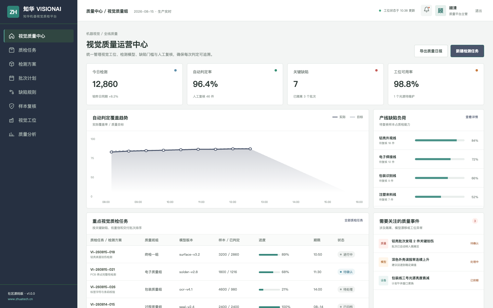
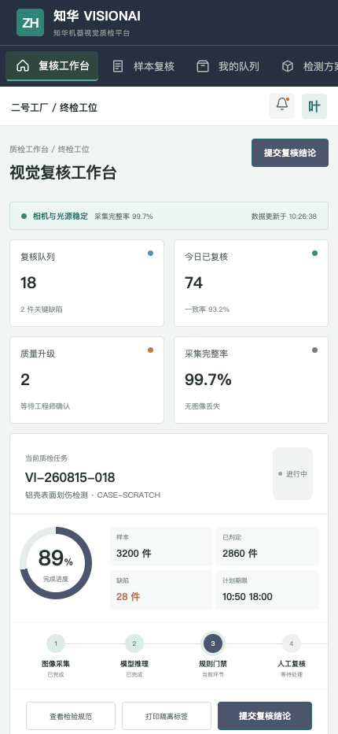

# ZhuaTech VisionAI

## 知华科技机器视觉质检平台社区源码版

机器视觉负责快速发现异常，质量人员负责最终放行。ZhuaTech VisionAI 将工业相机、边缘推理、缺陷规则、人工复核与批次隔离组织为可追踪的质量工作流。

发布与维护：**上海如静知华信息科技有限公司（知华科技）**

官网：[https://www.zhuatech.cn/](https://www.zhuatech.cn/)

    

## 质量运营端



统一查看视觉工位、自动判定率、关键缺陷、复核队列、模型漂移和设备健康，支持质量负责人按产线安排处置优先级。

## 现场复核端



面向质检员提供样本队列、缺陷位置、模型置信度、检测规范和人工覆盖入口。关键缺陷与低置信样本不会自动放行。

## 可运行的业务能力

| 环节 | 项目能力 |
| --- | --- |
| 采集 | 相机、光源、视角、产品版本和图像完整性 |
| 推理 | 模型版本、置信度、缺陷数量与面积比例 |
| 门禁 | `PASS / REVIEW / BLOCK`，关键缺陷强制隔离 |
| 复核 | 人工改判、原因、证据和质量工程师确认 |
| 运营 | 工位健康、误判漏判、缺陷趋势和批次追溯 |

核心参考接口为 `POST /api/ai/vision/inspect`。默认实现只处理结构化检测结果，不上传真实图像，也不依赖外部模型服务。企业落地时可对接自有 CV 模型或边缘推理平台。

## 启动演示

```bash
cd frontend
npm install
npm run dev:demo
```

访问 `http://localhost:5173`。管理端 `planner / Demo@2026`，复核端 `operator / Demo@2026`。后端采用 Java 21、Spring Boot、JWT、JPA、Flyway 和 MySQL，根包 `cn.zhuatech.visionai`。

更多信息：[API](docs/api.md) · [架构](docs/architecture.md) · [数据库](docs/database.md) · [部署](deploy/README.md)。演示图像编号、产品、人员和质量数据均为虚构内容。

## 许可边界

本工程仅允许个人学习、研究和非商业技术交流，**不得商用**。企业内部生产经营、私有化部署、SaaS、实施交付、收费服务、二次销售或品牌替换，必须取得上海如静知华信息科技有限公司书面授权，详见 [LICENSE](LICENSE)。

机器视觉质检、边缘 AI、工业相机集成、模型训练与项目外包，可访问[知华科技官网](https://www.zhuatech.cn/)或扫码咨询：

| 视觉 AI 技术咨询 | 商业授权与定制 |
| --- | --- |
|  |  |

SEO：机器视觉质检、工业视觉 AI、缺陷检测、CV 质检平台、Java 机器视觉源码、知华科技。
